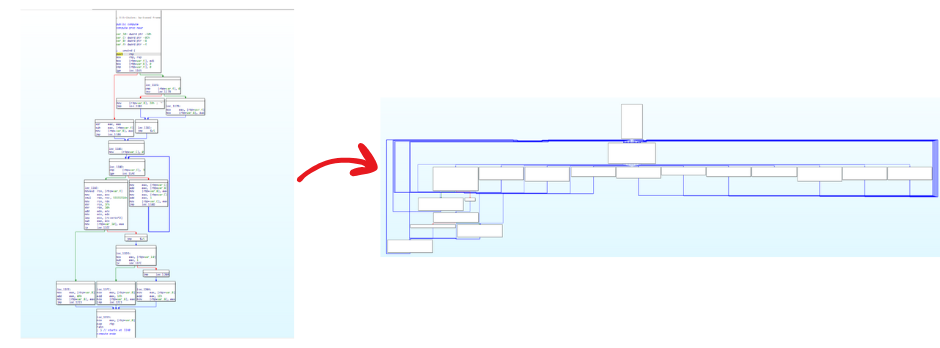

# llvm-obfuscation-passes
Educational collection of LLVM 17+ obfuscation passes. (Feel free to use it for your course)

NOTE: I used the skeleton and modified build system from https://github.com/sampsyo/llvm-pass-skeleton/

## Implemented Obfuscation Passes

### Mixed Boolean-Arithmetic (MBA) Transformations

| Pass | Description | Mathematical Identity |
|------|-------------|----------------------|
| **MBA_Add_Sub** | Obfuscates addition and subtraction using XOR/AND operations | `x + y → (x ⊕ y) + (x ∧ y) << 1` <br> `x - y → x + (-y)` |

### String Obfuscation
| Pass | Description | Technique |
|------|-------------|-----------|
| **String_Xor** | Obfuscates string literals using XOR encryption | Encrypts strings at compile-time, decrypts at runtime using external function |

### Control Flow Flattening
| Pass | Description | Technique |
|------|-------------|-----------|
| **CFF** | Flattens control flow using switch-based dispatcher | Converts all branches to a centralized switch statement that dispatches to basic blocks based on a state variable |
## Build Instructions
```bash
# Clone the repository
git clone https://github.com/your-username/llvm-obfuscation-passes.git
cd llvm-obfuscation-passes

# Build the passes
mkdir build && cd build
cmake ..
make -j$(nproc)
```

## Usage Examples

### MBA Obfuscation
```bash
# Navigate back to project root
cd ..

# Apply MBA obfuscation to your C code
clang -fpass-plugin=build/passes/mba_add_sub/MBA_Add_Sub_Pass.so \
      examples/mba_Add_Sub/mba_add_sub.c -o examples/mba_Add_Sub/mba_add_sub_obfuscated

# View the obfuscated IR
clang -fpass-plugin=build/passes/mba_add_sub/MBA_Add_Sub_Pass.so \
      -S -emit-llvm examples/mba_Add_Sub/mba_add_sub.c -o examples/mba_Add_Sub/mba_add_sub_obfuscated.ll

# Compare original vs obfuscated
clang -S -emit-llvm examples/mba_Add_Sub/mba_add_sub.c -o examples/mba_Add_Sub/mba_add_sub_original.ll
diff examples/mba_Add_Sub/mba_add_sub_original.ll examples/mba_Add_Sub/mba_add_sub_obfuscated.ll
````
### String XOR Obfuscation

```bash
# Compile the external decrypt function to object file
clang -c external/decrypt_string_xor.c -o external/decrypt_string_xor.o

# Apply string XOR obfuscation and compile to object file
clang -fpass-plugin=build/passes/string_xor/String_Xor_Pass.so \
      -c examples/StringXor/string_xor.c -o examples/StringXor/string_xor_obfuscated.o

# Link both object files to create the final executable
clang examples/StringXor/string_xor_obfuscated.o external/decrypt_string_xor.o \
      -o examples/StringXor/string_xor_obfuscated

# View the obfuscated IR
clang -fpass-plugin=build/passes/string_xor/String_Xor_Pass.so \
      -S -emit-llvm examples/StringXor/string_xor.c -o examples/StringXor/string_xor_obfuscated.ll

# Compare original vs obfuscated
clang -S -emit-llvm examples/StringXor/string_xor.c -o examples/StringXor/string_xor_original.ll
diff examples/StringXor/string_xor_original.ll examples/StringXor/string_xor_obfuscated.ll
```
### Control Flow Flattening
```bash
# Navigate back to project root
cd ..

# Apply MBA obfuscation to your C code
clang -fpass-plugin=build/passes/cff/CFF_Pass.so \
      examples/CFF/cff.c -o examples/CFF/cffed

# View the obfuscated IR
clang -fpass-plugin=build/passes/cff/CFF_Pass.so \
      -S -emit-llvm examples/CFF/cff.c -o examples/CFF/cffed.ll

# Compare original vs obfuscated
clang -S -emit-llvm examples/CFF/cff.c -o examples/CFF/normal.ll
diff examples/CFF/normal.ll examples/CFF/cffed.ll
````

## Development

### Adding New Passes

1. Create a new directory under `passes/your_pass_name/`.  
2. Add your pass implementation in `passes/your_pass_name/YourPass.cpp`.  
3. Create `passes/your_pass_name/CMakeLists.txt` following the existing pattern (in the other passes).  
4. Add the subdirectory to `passes/CMakeLists.txt`.  
5. Create test cases in `examples/`.  
6. Update this `README.md` to document the new pass.

## Contributing

Contributions are welcome! Please feel free to:

- Add new obfuscation passes
- Improve existing implementations  
- Add test cases and examples
- Fix bugs or improve documentation
- Suggest new features

## Disclaimer

This software is intended for educational and research purposes only. Users are responsible for ensuring compliance with applicable laws and regulations when using obfuscation techniques.
